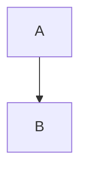

# Feroces Dolls - Site statique (Hugo + TailwindCSS)

Site du collectif Feroces Dolls, construit avec Hugo (extended) et un theme custom `feroce`.

## Stack technique

- Hugo Extended `0.155.x`
- TailwindCSS `3.x`
- Node.js `20.x`
- GitHub Actions (CI + deploy Pages)

## Demarrage rapide

1. Installer les dependances Node:

```bash
npm ci
```

2. Lancer en local (avec brouillons):

```bash
npm run dev
```

3. Build production:

```bash
npm run build
```

Le dossier genere est `public/`.

## Commandes Hugo utiles (sans npm)

Lancer le serveur local:

```bash
hugo server -D
```

Build production:

```bash
hugo --gc --minify
```

Creer du contenu depuis les archetypes:

```bash
hugo new blog/mon-article.md
hugo new agenda/mon-evenement.md
hugo new ressources/ma-ressource.md
hugo new glossaire/mon-terme.md
hugo new activites/ma-nouvelle-activite.md
```

Lister les contenus dates dans le futur:

```bash
hugo list future
```

## Structure du projet

- `content/`: contenu editorial (blog, agenda, ressources, glossaire, etc.)
- `archetypes/`: modeles de frontmatter pour creation de nouveaux contenus
- `themes/feroce/`: layouts Hugo + CSS Tailwind du theme
- `static/`: fichiers statiques copies tels quels (icons, images, JS vendor, CNAME)
- `scripts/`: scripts utilitaires (glossaire, medias ressources)
- `.github/workflows/`: CI et deploiement GitHub Pages

## Config Hugo principale

Fichier: `hugo.toml`

Points importants:

- `buildFuture = true`: les contenus dates dans le futur sont bien buildes
- Menu principal configure via `[[menus.main]]`
- Output ICS active pour les evenements agenda
- Parametres sociaux:
  - email
  - Instagram
  - Mastodon

## Sections de contenu

### Accueil

- Fichier: `content/_index.md`
- Utilise pour le texte d'intro de la homepage.

### Activites

- Dossier: `content/activites/`
- Cree une fiche:

```bash
hugo new activites/ma-nouvelle-activite.md
```

- Archetype: `archetypes/activite.md`
- Champs utiles:
  - `title`
  - `weight` (ordre d'affichage)
  - `image` / `image_alt`

### Blog

- Dossier: `content/blog/`
- Creer un article:

```bash
hugo new blog/mon-article.md
```

- Archetype: `archetypes/blog.md`
- Champs utiles:
  - `title`
  - `date`
  - `summary`
  - `image` / `image_alt`
  - `draft`

Regle actuelle:

- Les articles dates dans le futur ne sont pas affiches publiquement dans la liste (strategie "blog futur non").

### Agenda

- Dossier: `content/agenda/`
- Creer un evenement:

```bash
hugo new agenda/mon-evenement.md
```

- Archetype: `archetypes/agenda.md`
- Champs utiles:
  - `title`
  - `date`
  - `start`
  - `end`
  - `location`
  - `tags`
  - `color`
  - `post_ref` (lien vers un post associe)
  - `outputs = ['HTML', 'ICS']`

Regles actuelles:

- Agenda affiche futur + passe (strategie "agenda futur oui").
- Bouton "Ajouter a l'agenda" (ICS) reserve aux evenements futurs.
- Le basculement futur/passe se fait au build suivant.

### Ressources

- Dossier: `content/ressources/`
- Creer une ressource:

```bash
hugo new ressources/ma-ressource.md
```

- Archetype: `archetypes/ressource.md`
- Champs utiles:
  - `title`
  - `category`
  - `external_url`
  - `external_url_2` (optionnel)
  - `external_icon` / `external_card` (medias locaux telecharges)
  - `image` / `icon` (alternatives locales)

### Glossaire

- Dossier: `content/glossaire/`
- Creer un terme:

```bash
hugo new glossaire/mon-terme.md
```

- Archetype: `archetypes/glossaire.md`
- Champs utiles:
  - `title`
  - `summary`
  - `synonyms = []`
  - `category`

### Dons et Contact

- Pages simples:
  - `content/dons.md`
  - `content/contact.md`

## Shortcode glossaire

Shortcode disponible:

```md

```

Exemple:

```md
Les gouters sont en .
```

Fichier du shortcode:

- `themes/feroce/layouts/shortcodes/terme.html`

## Mermaid (diagrammes dans les articles)

Les blocs Mermaid sont supportes dans Markdown:

````md

````

Implementation:

- Render hook: `themes/feroce/layouts/_default/_markup/render-codeblock-mermaid.html`
- Script local: `static/vendor/mermaid.min.js`
- Injection conditionnelle dans `themes/feroce/layouts/_default/baseof.html`

Note:

- Le rendu Mermaid depend de JavaScript (fallback texte sinon).

## Scripts utilitaires

### Scanner les premieres occurrences de termes du glossaire

```bash
npm run glossaire:scan
```

Version ciblee ressources:

```bash
npm run glossaire:scan:ressources
```

Script: `scripts/glossaire-scan.mjs`

### Recuperer icones/cards de ressources et ecrire localement

Dry-run:

```bash
npm run ressources:media
```

Ecriture:

```bash
npm run ressources:media:write
```

Forcer la reecriture:

```bash
npm run ressources:media:force
```

Script: `scripts/ressources-media.mjs`

## Theme et styles

- CSS principal: `themes/feroce/assets/css/main.css`
- Layout de base: `themes/feroce/layouts/_default/baseof.html`
- Header: `themes/feroce/layouts/partials/header.html`
- Footer: `themes/feroce/layouts/partials/footer.html`

Le theme gere:

- mode clair/sombre
- navbar responsive
- styles markdown (`.copy`)
- boutons et panels

## Workflows GitHub Actions

### CI build

- Fichier: `.github/workflows/hugo-ci.yml`
- Lance un build Hugo sur push / PR / manuel.
- Publie un artefact `public-site`.

### Deploy GitHub Pages

- Fichier: `.github/workflows/deploy.yml`
- Lance sur push `main/master`, manuel, et cron quotidien.
- Build avec base URL GitHub Pages dynamique.
- Deploie sur GitHub Pages.

## Conseils de contribution

1. Creer le contenu avec `hugo new ...` pour partir du bon archetype.
2. Remplir les champs frontmatter avant publication.
3. Verifier localement avec `npm run dev`.
4. Verifier un build propre avec `npm run build`.
5. Ouvrir une PR (ou push) pour declencher CI/deploy.

## Depannage rapide

- CSS absent sur Pages:
  - verifier le workflow deploy et la `baseURL` appliquee au build.
- Un article blog n'apparait pas:
  - verifier `draft = false`
  - verifier que `date` n'est pas dans le futur
- Un evenement agenda ne passe pas en "passe":
  - relancer un build/deploy
- Mermaid ne suit pas le theme:
  - verifier `static/vendor/mermaid.min.js`
  - verifier les scripts Mermaid dans `baseof.html`
