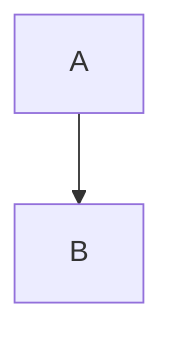

# Feroces Dolls - Site statique (Hugo + TailwindCSS)

Site du collectif Feroces Dolls, construit avec Hugo (extended) et un theme custom `feroce`.

## Stack technique

- Hugo Extended `0.155.x`
- TailwindCSS `3.x`
- Node.js `20.x`
- GitHub Actions (CI + deploy Pages)

## Demarrage rapide

1. Installer les dependances Node:

```bash
npm ci
```

2. Lancer en local (avec brouillons):

```bash
npm run dev
```

3. Build production:

```bash
npm run build
```

Le dossier genere est `public/`.

## Commandes Hugo utiles (sans npm)

Lancer le serveur local:

```bash
hugo server -D
```

Build production:

```bash
hugo --gc --minify
```

Creer du contenu depuis les archetypes:

```bash
hugo new blog/mon-article.md
hugo new agenda/mon-evenement.md
hugo new ressources/ma-ressource.md
hugo new glossaire/mon-terme.md
hugo new activites/ma-nouvelle-activite.md
```

Lister les contenus dates dans le futur:

```bash
hugo list future
```

Lister les brouillons:

```bash
hugo list drafts
```

Builder en incluant les brouillons (test local):

```bash
hugo --gc --minify --buildDrafts
```

## Structure du projet

- `content/`: contenu editorial (blog, agenda, ressources, glossaire, etc.)
- `archetypes/`: modeles de frontmatter pour creation de nouveaux contenus
- `themes/feroce/`: layouts Hugo + CSS Tailwind du theme
- `static/`: fichiers statiques copies tels quels (icons, images, JS vendor, CNAME)
- `scripts/`: scripts utilitaires (glossaire, medias ressources)
- `.github/workflows/`: CI et deploiement GitHub Pages

## Config Hugo principale

Fichier: `hugo.toml`

Points importants:

- `buildFuture = true`: les contenus dates dans le futur sont bien buildes
- Menu principal configure via `[[menus.main]]`
- Output ICS active pour les evenements agenda
- Parametres sociaux:
  - email
  - Instagram
  - Mastodon

### Sections activables (robuste)

Le projet permet d'activer/desactiver les sections sans supprimer leur contenu.

Configuration dans `hugo.toml`:

```toml
[params.sections]
  home = true
  activites = true
  blog = true
  agenda = true
  dons = true
  ressources = true
  glossaire = true
  contact = true
```

Effets:

- la navbar masque automatiquement les sections a `false`
- la home masque le bloc activites si `activites = false`
- les pages liste/single de section desactivee affichent un message "section desactivee"
- le contenu reste dans le repo et peut etre reactive plus tard en remettant `true`

## Ajouter une section

Le plus important: il y a 2 types de sections dans ce projet.

1. Section "dossier" (ex: `blog`, `agenda`, `ressources`, `glossaire`, `activites`)
2. Section "page simple" (ex: `dons`, `contact`, `charte`)

### 1) Ajouter une section dossier

Exemple: `charte-technique` comme nouvelle section liste + pages.

1. Creer le dossier de contenu:
```bash
mkdir content/charte-technique
```
2. Creer la page index de section:
```bash
hugo new charte-technique/_index.md
```
3. (Optionnel) Creer un archetype dedie:
- `archetypes/charte-technique.md`
4. Ajouter la section aux toggles:
- `hugo.toml` > `[params.sections]`:
```toml
charte-technique = true
```
5. Ajouter la section au menu:
- `hugo.toml` > `[[menus.main]]`:
```toml
[[menus.main]]
  name = 'Charte technique'
  pageRef = '/charte-technique'
  weight = 25
```
6. Creer du contenu dedans:
```bash
hugo new charte-technique/premiere-page.md
```

### 2) Ajouter une section page simple

Exemple: `mentions-legales` en page unique.

1. Creer la page:
```bash
hugo new mentions-legales.md
```
2. Ajouter la section aux toggles:
- `hugo.toml` > `[params.sections]`:
```toml
mentions-legales = true
```
3. Ajouter au menu:
```toml
[[menus.main]]
  name = 'Mentions legales'
  pageRef = '/mentions-legales'
  weight = 70
```
4. Ajouter le slug a la normalisation des pages simples:
- fichier `themes/feroce/layouts/partials/page-section-key.html`
- dans le bloc `if or (...)`, ajouter:
```go-html-template
(eq $base "mentions-legales")
```

Sans cette etape, la section s'affiche bien, mais le toggle `params.sections.mentions-legales` ne sera pas applique comme prevu sur cette page simple.

### 3) (Optionnel) Rendu specifique de la section

Par defaut, la section passera par les templates generiques:
- `themes/feroce/layouts/_default/list.html`
- `themes/feroce/layouts/_default/single.html`

Si tu veux un rendu custom:
- soit ajouter des conditions `if eq .Section "ma-section"` dans ces templates
- soit creer des templates dedies:
  - `themes/feroce/layouts/ma-section/list.html`
  - `themes/feroce/layouts/ma-section/single.html`

### 4) Verification

Tester localement:
```bash
hugo --gc --minify
```

Verifier:
- la section apparait dans la navbar
- la page/liste s'affiche
- le toggle `[params.sections]` masque bien la section quand passe a `false`

## Drafts et dates

### Drafts

- `draft = true`: la page n'est pas publiee par defaut.
- `draft = false`: la page est publiable.
- En local, `npm run dev` utilise `hugo server -D`, donc les drafts sont visibles.
- En CI/deploy, les builds utilisent `hugo --gc --minify` (sans `-D`), donc les drafts ne sont pas publies.

### Dates futures

- Le projet a `buildFuture = true` dans `hugo.toml`, donc les contenus dates dans le futur sont buildes.
- Regle metier du site:
  - agenda futur: oui
  - blog futur: non (masque dans les listes publiques du blog)

## Sections de contenu

### Accueil

- Fichier: `content/_index.md`
- Utilise pour le texte d'intro de la homepage.

### Activites

- Dossier: `content/activites/`
- Cree une fiche:

```bash
hugo new activites/ma-nouvelle-activite.md
```

- Archetype: `archetypes/activite.md`
- Champs utiles:
  - `title`
  - `weight` (ordre d'affichage)
  - `image` / `image_alt`

### Blog

- Dossier: `content/blog/`
- Creer un article:

```bash
hugo new blog/mon-article.md
```

- Archetype: `archetypes/blog.md`
- Champs utiles:
  - `title`
  - `date`
  - `summary`
  - `image` / `image_alt`
  - `draft`

Regle actuelle:

- Les articles dates dans le futur ne sont pas affiches publiquement dans la liste (strategie "blog futur non").

### Agenda

- Dossier: `content/agenda/`
- Creer un evenement:

```bash
hugo new agenda/mon-evenement.md
```

- Archetype: `archetypes/agenda.md`
- Champs utiles:
  - `title`
  - `date`
  - `start`
  - `end`
  - `location`
  - `tags`
  - `color`
  - `post_ref` (lien vers un post associe)
  - `outputs = ['HTML', 'ICS']`

Regles actuelles:

- Agenda affiche futur + passe (strategie "agenda futur oui").
- Bouton "Ajouter a l'agenda" (ICS) reserve aux evenements futurs.
- Le basculement futur/passe se fait au build suivant.

### Ressources

- Dossier: `content/ressources/`
- Creer une ressource:

```bash
hugo new ressources/ma-ressource.md
```

- Archetype: `archetypes/ressource.md`
- Champs utiles:
  - `title`
  - `category`
  - `external_url`
  - `external_url_2` (optionnel)
  - `external_icon` / `external_card` (medias locaux telecharges)
  - `image` / `icon` (alternatives locales)

### Glossaire

- Dossier: `content/glossaire/`
- Creer un terme:

```bash
hugo new glossaire/mon-terme.md
```

- Archetype: `archetypes/glossaire.md`
- Champs utiles:
  - `title`
  - `summary`
  - `synonyms = []`
  - `category`

### Dons et Contact

- Pages simples:
  - `content/dons.md`
  - `content/contact.md`

## Shortcode glossaire

Shortcode disponible:

```md

```

Exemple:

```md
Les gouters sont en .
```

Fichier du shortcode:

- `themes/feroce/layouts/shortcodes/terme.html`

## Shortcode download

Shortcode pour ajouter un lien/bouton de telechargement (PDF, doc, etc.) dans un contenu Markdown.

Exemple local (fichier dans `static/`):

```md

```

Exemple externe:

```md

```

Exemple avec nom de fichier force:

```md

```

Parametres:

- `path` (obligatoire): chemin local (depuis `static/`) ou URL complete
- `label` (optionnel): texte du lien
- `filename` (optionnel): nom suggere au telechargement
- `class` (optionnel): classes CSS (defaut: `btn btn-secondary`)
- `download` (optionnel): `true`/`false` (defaut: `true`)

Fichier du shortcode:

- `themes/feroce/layouts/shortcodes/download.html`

## Shortcode insta

Shortcode pour transformer rapidement un handle Instagram en lien.

Exemples:

```md




```

Parametres:

- `handle` (ou argument 1, obligatoire): `@compte`, `compte`, ou URL Instagram complete
- `label` (ou argument 2, optionnel): texte affiche
- `class` (optionnel): classes CSS
- `blank` (optionnel): `true`/`false` pour ouvrir dans un nouvel onglet (defaut: `true`)

Fichier du shortcode:

- `themes/feroce/layouts/shortcodes/insta.html`

## Shortcode mastodon

Shortcode pour transformer rapidement un handle Mastodon en lien.

Exemples:

```md




```

Parametres:

- `handle` (ou argument 1, obligatoire): `@user@instance`, `user@instance`, ou URL Mastodon complete
- `label` (ou argument 2, optionnel): texte affiche
- `class` (optionnel): classes CSS
- `blank` (optionnel): `true`/`false` pour ouvrir dans un nouvel onglet (defaut: `true`)

Fichier du shortcode:

- `themes/feroce/layouts/shortcodes/mastodon.html`

## Shortcode mail

Shortcode pour generer un lien email `mailto:` avec obfuscation progressive.

Exemples:

```md



```

Parametres:

- `address` (ou argument 1, obligatoire): adresse email
- `label` (ou argument 2, optionnel): texte affiche
- `subject` (optionnel): sujet du mail pre-rempli
- `class` (optionnel): classes CSS
- `obfuscate` (optionnel): `true`/`false` (defaut: `true`)

Notes:

- Avec `obfuscate=true`:
  - sans JavaScript: le texte affiche `name [at] domain [dot] tld` (lisible humainement)
  - avec JavaScript: le texte est remplace par un vrai lien `mailto:`
- Ce n'est pas une protection absolue, mais c'est plus robuste qu'un email en clair.

Fichier du shortcode:

- `themes/feroce/layouts/shortcodes/mail.html`

## Mermaid (diagrammes dans les articles)

Les blocs Mermaid sont supportes dans Markdown:

````md

````

Implementation:

- Render hook: `themes/feroce/layouts/_default/_markup/render-codeblock-mermaid.html`
- Script local: `static/vendor/mermaid.min.js`
- Injection conditionnelle dans `themes/feroce/layouts/_default/baseof.html`

Note:

- Le rendu Mermaid depend de JavaScript (fallback texte sinon).

## Scripts utilitaires

### Scanner les premieres occurrences de termes du glossaire

```bash
npm run glossaire:scan
```

Version ciblee ressources:

```bash
npm run glossaire:scan:ressources
```

Script: `scripts/glossaire-scan.mjs`

### Recuperer icones/cards de ressources et ecrire localement

Dry-run:

```bash
npm run ressources:media
```

Ecriture:

```bash
npm run ressources:media:write
```

Forcer la reecriture:

```bash
npm run ressources:media:force
```

Script: `scripts/ressources-media.mjs`

## Theme et styles

- CSS principal: `themes/feroce/assets/css/main.css`
- Layout de base: `themes/feroce/layouts/_default/baseof.html`
- Header: `themes/feroce/layouts/partials/header.html`
- Footer: `themes/feroce/layouts/partials/footer.html`

Le theme gere:

- mode clair/sombre
- navbar responsive
- styles markdown (`.copy`)
- boutons et panels

## Workflows GitHub Actions

### CI build

- Fichier: `.github/workflows/hugo-ci.yml`
- Lance un build Hugo sur push / PR / manuel.
- Publie un artefact `public-site`.

### Deploy GitHub Pages

- Fichier: `.github/workflows/deploy.yml`
- Lance sur push `main/master`, manuel, et cron quotidien.
- Build avec base URL GitHub Pages dynamique.
- Deploie sur GitHub Pages.

## Conseils de contribution

1. Creer le contenu avec `hugo new ...` pour partir du bon archetype.
2. Remplir les champs frontmatter avant publication.
3. Verifier localement avec `npm run dev`.
4. Verifier un build propre avec `npm run build`.
5. Ouvrir une PR (ou push) pour declencher CI/deploy.

## Depannage rapide

- CSS absent sur Pages:
  - verifier le workflow deploy et la `baseURL` appliquee au build.
- Un article blog n'apparait pas:
  - verifier `draft = false`
  - verifier que `date` n'est pas dans le futur
- Un evenement agenda ne passe pas en "passe":
  - relancer un build/deploy
- Mermaid ne suit pas le theme:
  - verifier `static/vendor/mermaid.min.js`
  - verifier les scripts Mermaid dans `baseof.html`
