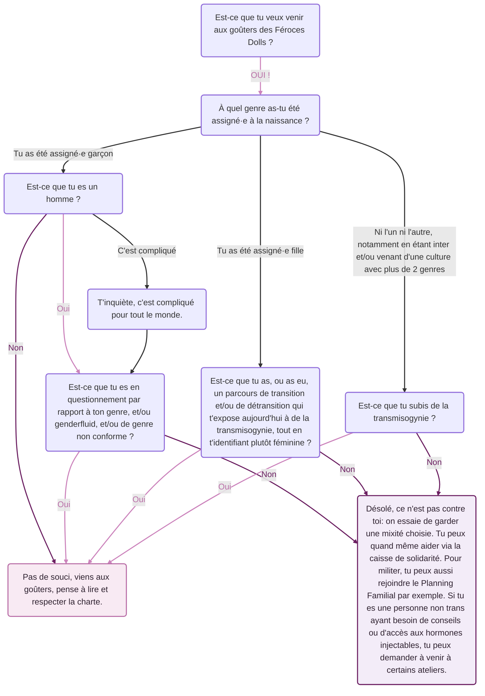

+++
title = "Qui peut venir aux goûters des Féroces Dolls ?"
date = "2026-02-16T18:00:00+01:00"
image = "bandeau_trans.jpg"
image_alt = "Affiche des goûters transfem*"
draft = false
+++

On nous pose souvent la question : **Est-ce que moi je peux venir aux goûters des Féroces Dolls ?**

Les goûters sont en ** **, mais c'est pas toujours exactement clair non plus qui ça concerne exactement.

Le plus efficace est d'utiliser ce schéma indicatif. Mais si tu as un doute, tu peux toujours nous écrire :)

Merci de respecter la mixitée choisie, elle sert à protéger un espace de sociabilisation et de soutien pour des personnes exposées à des violences.

